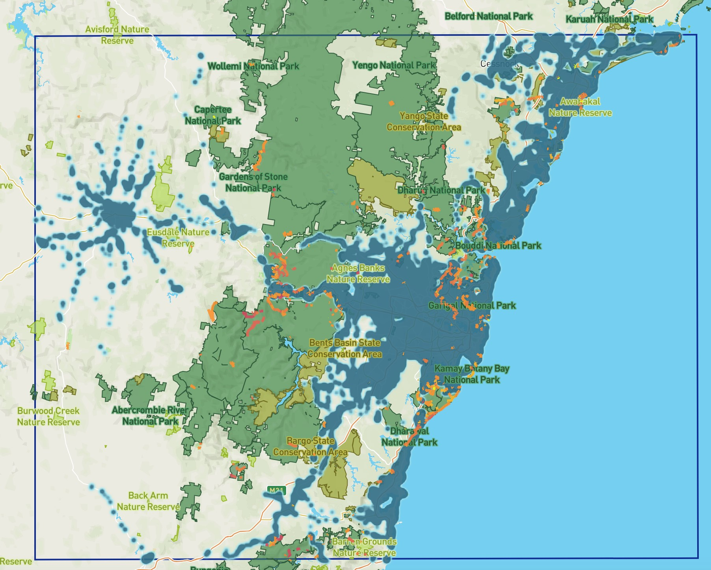
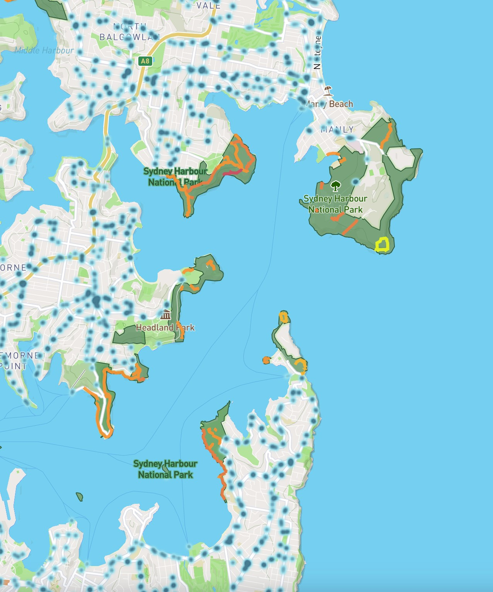

# GIS III Proj
Final Project for GIS III

[Mapbox Visualisation](https://api.mapbox.com/styles/v1/ghancock/cl3p68jjt003014qb4etyu2zd.html?title=view&access_token=pk.eyJ1IjoiZ2hhbmNvY2siLCJhIjoiY2wzcDM3MnV5MHVhNzNkbTl2bGgxaDN1eSJ9.eJmD2VhGupYhQqymFPV0Kw&zoomwheel=true&fresh=true#11.2/-33.8334/151.2656)

## Introduction

National Parks and other areas managed by the New South Wales National Parks and Wildlife Service (NPWS) play an important role in people’s access to the outdoors and environment. I wanted to visual how accessible parks are without a car through using GTFS data and walking track grades. I originally intended to create a map for the whole state, however due to the upload size limit on Mapbox, I elected to create a smaller project area that encompassed Sydney, Wollongong, and Newcastle as that is where a significant proportion of people in NSW live. 

## Background

National Parks and park systems and management have been established in many countries globally however there is no international standard for the management and creation of these parks (Frost and Laing 2013). In _From Yellowstone to Australia and New Zealand: National Parks 2.0_ Frost and Laing state how Yellowstone is considered the first National Park (established in 1872) and is the basis of the _Yellowstone Model_ which contains 5 factors:
1.	The name national park
2.	Natural monumentalism is the justification for preservation
3.	Visitors will be attracted and must be catered for
4.	National park status is conferred by the national government
5.	It is a permanently protected area

It is likely the Yellowstone influenced the creation of the first national park in Australia, the Royal National Park in 1879. Royal was different to Yellowstone in that it did not have a monumental feature(s) and instead was established due to its accessibility (it is very close to Sydney and accessible via train). It was intended to be a recreational area. This was counter to the Yellowstone model and our modern conception of national parks as prominently preservation and conservation areas with recreation being a secondary attribute. The later establishment of Lamington National Park shows the shift towards preservation as it was largely done in an effort to preserve the rainforests which were rapidly being cleared throughout Australia to make space for agriculture. The establishment of Wyperfeld National Park also showed a shift in national park framework as it was intended to preserve a specific ecosystem and endangered wildlife. 

The intent behind the creation of national parks has varied throughout time but there are some common cultural factors (Shultis 1995). In _Improving The Wilderness: Common Factors In Creating National Parks And Equivalent Reserves During The Nineteenth Century_, Shultis establishes various factors at the core of the establishment of parks across various nations/colonies including but not limited to:
* Availability of natural resources and public land: often the land in the colonies was held in the public trust so it was relatively easy to establish parks, there also were few people which resulted in there being an abundance of natural resources.
* Management of natural attractions: there had been public backlash and criticism of the mismanagement of significant public attractions (e.g. Niagara Falls) which encouraged a governmental approach.
*	Desire to generate revenue: parks were often tourist attractions, close to cities and accessible by train (this is especially true in Australia), there is also revenue generated through the exploitation of the natural resources within parks.
*	Increasing destruction of wilderness and wildlife: as the colonies grew and spread, the rapid destruction of the environment signalled that something would need to change.
*	Calls for public recreation areas: urbanisation led to a concern about the health of the people and there was a push for outdoor spaces.

Australia’s National Parks system is distinctive for how it is managed (Wescott 1991). While most national park systems are managed at a federal level, in Australia the management is done at a state level. This leads to varying definitions of what constitutes a national park. Wescott considers this a major disadvantage to the Australian National Parks system, however, still acknowledges that the system performs on the international scale. An example of this is the winning of the 2008 UNESCO Heritage Award of Distinction by the restoration project of National Pass in Blue Mountains National Park by the New South Waler National Parks and Wildlife Service (UNESCO 2008).

Public transit is an important aspect of park accessibility. In Australia, use of public transport has increased significantly with growing cities (Burke 2016). In _Problems and Prospects for Public Transport Planning in Australian Cities_, Burke looks at how funding is struggling to keep up with the expanding transit needs. He paints the history surrounding railways in Australia and their role in major cities. In the case of Sydney, the extensive public tram system was dismantled when automobiles began being manufactured and widespread. These problems from automobile focused city planning, highlight how important it is that the pre-existing public transportation infrastructure provides access to parks.

In a case study of Shanghai, it is emphasised that urban parks/greenspaces and public transport are independently important but not often considered in tandem (Liang and Zhang 2017). They worked to conduct a measure for park accessibility by public transport in a more robust manner than just using distance measures. It combines GIS network analysis and accessibility calculations to achieve this more precise measure. Something akin to this could be pursued in future work.

## Data

The two primary variables in this visualisation were transit data and walking track data. 

### Transit Variable

The transit variable was the Timetables Complete GTFS dataset from [NSW Transport Open Data](https://opendata.transport.nsw.gov.au/dataset/timetables-complete-gtfs). The stops were cleaned and converted to a shapefile using the following [Transit R Script](Scripts/GTFS_Data.R).

### Track Variable

The track variable was the Asset Infrastructure – Track Section dataset from [NSW SEED Datasets]( https://www.datasets.seed.nsw.gov.au/dataset/d814e21d-56d0-4ee6-a594-afb57d142de9/metaexport/html). The track sections were cleaned to a shapefile using the following [Tracks R Script](Scripts/Tracks_Data.R).

In the R script, you can see the use of [DEM data from Earth Explorer]( https://earthexplorer.usgs.gov/) to generate slope gradients for each track segment. I t was [Shuttle Radar Topography Mission (SRTM) 1 Arc-Second Global data]( https://www.usgs.gov/centers/eros/science/usgs-eros-archive-digital-elevation-shuttle-radar-topography-mission-srtm-1?qt-science_center_objects=0#qt-science_center_objects). These grades are seen in the [tmap html output](Visualisations/Slopes.html) and below.

#### Summary of tracks by NPWS Walking Grade

| Class 1 All Access Track | Class 2 Graded Track | Class 3 Walking Track | Class 4 Hiking Track | Class 5 Marked Route | Class 6 Unmarked Route | Not Applicable | Unknown |
|--------------------------|----------------------|-----------------------|----------------------|----------------------|------------------------|----------------|---------|
| 3.6                      | 8.2                  | 39.0                  | 19.6                 | 3.5                  | 2.7                    | 23.1           | 0.2     |

#### Summary of tracks by DEM Slope
| 0-3: flat | 3-5: mild | 5-8: medium | 8-10: hard | 10-20: extreme | >20: impossible |
|-----------|-----------|-------------|------------|----------------|-----------------|
| 7.8       | 10.2      | 21.3        | 13.6       | 33.2           | 13.8            |

As you can see, far more fall into the steeper/more challenging categories when using the DEM data, which I believe may have been due to the varying lengths of segment and perhaps the reprojection of the track segments. Thus, I elected to use the NPWS grades in my visualisation as I think they are a better metric for seeing if a track is accessible.

## Visualisation

I elected to use mapbox to visualise the data though I had some issues with the end product not being as interactive as I had hope. The map can be accessed [here]( https://api.mapbox.com/styles/v1/ghancock/cl3p68jjt003014qb4etyu2zd.html?title=view&access_token=pk.eyJ1IjoiZ2hhbmNvY2siLCJhIjoiY2wzcDM3MnV5MHVhNzNkbTl2bGgxaDN1eSJ9.eJmD2VhGupYhQqymFPV0Kw&zoomwheel=true&fresh=true#11.2/-33.8334/151.2656).

The blue heatmap is a visualisation of the transit data. The NPWS areas are represented through the labelled polygons. The walking tracks are represented by lines with their colour representative of their grade (red is higher grade).

